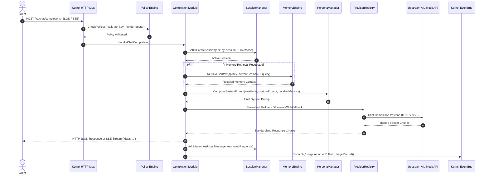

# Completion Module — Technical Design Document

## 1. Executive Summary & Design Philosophy

The `completion` module serves as the primary AI inference gateway for the `ai-saas-lab` platform. Designed with production-grade modularity, provider agnosticism, and stateful interaction capabilities, it enables streaming and non-streaming text generation across mock engines and any OpenAI-compatible inference API (e.g., OpenAI, Groq, Ollama, DeepSeek, LocalAI, vLLM).

### Design Principles

1. **Provider Strategy Pattern**: Core completion logic is decoupled from provider implementations via the `CompletionProvider` interface. Providers are registered dynamically in a thread-safe `ProviderRegistry` with automatic fallback mechanisms.
2. **Stateful Session Management**: Supports multi-turn chat threads with thread-safe history accumulation, retrieval, and lifecycle management.
3. **Cross-Session Memory Synthesis**: Evaluates user history across previous conversation sessions to recall pertinent context and inject synthesized memories into the LLM context.
4. **Adaptive Role & Persona Switching**: Offers customizable system prompts and built-in role modes (`developer`, `analyst`, `creative`, `tutor`, `support`) that adapt system instructions dynamically.
5. **Decoupled Architecture & Kernel Integration**: Interacts with the shared `kernel.App` using policy checks (`valid-api-key`, `under-quota`) and emits gob-encoded `usage.recorded` events for consumption by the `billing` module without compile-time module coupling.

---

## 2. System Architecture & Information Flow



---

## 3. Module Subsystems & Technical Details

### 3.1 Provider Strategy (`provider.go`, `provider_openai.go`, `provider_mock.go`)

The module uses a Strategy pattern to decouple request orchestration from inference execution.

#### Provider Interface
```go
type CompletionProvider interface {
    Name() string
    Generate(ctx context.Context, req *ChatRequest) (*ChatResponse, error)
    Stream(ctx context.Context, req *ChatRequest) (<-chan StreamChunk, error)
}
```

#### Provider Implementations
- **`MockProvider`**: Deterministic provider for offline testing and rapid iteration. Supports word-by-word streaming, configurable latency (`SimulatedDelay`), and mock error injection (`SimulateError`).
- **`OpenAICompatibleProvider`**: Standardized HTTP/SSE client targeting any OpenAI-compliant `/v1/chat/completions` REST API. Features:
  - Custom `BaseURL` (e.g. `https://api.openai.com/v1`, `http://localhost:11434/v1`, `https://api.groq.com/openai/v1`).
  - Real-time Server-Sent Events (SSE) stream processing.
  - Upstream error code translation (`401 Unauthorized`, `429 Rate Limit`, `5xx Server Error`).
  - Exponential backoff retry loop for transient failures (retries up to 3 times on `429`, `502`, `503`, `504`).

#### Fallback Registry (`ProviderRegistry`)
Requests specify a target provider (`provider: "openai"`, `provider: "mock"`). If the primary provider encounters an unrecoverable failure or rate limit, the registry automatically fails over to the fallback provider (`mock`).

---

### 3.2 Session & Conversation Storage (`session.go`)

`SessionManager` provides thread-safe storage for multi-turn chat threads.

#### Data Model
```go
type Session struct {
    ID        string        `json:"id"`
    APIKey    string        `json:"api_key"`
    Persona   string        `json:"persona"`
    Messages  []ChatMessage `json:"messages"`
    CreatedAt time.Time     `json:"created_at"`
    UpdatedAt time.Time     `json:"updated_at"`
}

type ChatMessage struct {
    Role      string    `json:"role"` // "system", "user", "assistant"
    Content   string    `json:"content"`
    Timestamp time.Time `json:"timestamp,omitempty"`
}
```

#### Key Capabilities
- **Thread Safety**: Read/Write operations guarded by `sync.RWMutex`.
- **User Indexing**: Tracks session IDs per `APIKey` for efficient user-scoped queries.
- **Transcript History**: Appends incoming user questions and outgoing assistant responses upon completion.

---

### 3.3 Memory & Cross-Session Context Engine (`memory.go`)

`MemoryEngine` enables the AI to "remember" context from previous conversation threads.

#### Context Recall Mechanism
1. Scans all active sessions belonging to the calling `APIKey` (excluding the current session ID).
2. Performs keyword-matching against `MemoryQuery` or extracts key user/assistant message pairs.
3. Formats memories into a structured System Prompt extension:
   ```text
   [RECALLED CONTEXT FROM PREVIOUS CONVERSATIONS]
   - (Session sess-16892300-a1b2) USER: I prefer Go 1.22 and PostgreSQL for my microservices.
   - (Session sess-16892300-c3d4) ASSISTANT: We discussed building an AI SaaS MVP platform.
   [END RECALLED CONTEXT]
   ```
4. Injects the synthesized memory block into the LLM system prompt prior to provider invocation.

---

### 3.4 Adaptive Personas & Dynamic System Prompts (`persona.go`)

`PersonaManager` formats and injects behavioral instructions based on the requested `RoleMode`.

#### Built-in Personas

| Persona ID | Name | Core Behavior / System Instruction Summary |
| :--- | :--- | :--- |
| `default` | General Assistant | Helpful, precise, general-purpose assistant. |
| `developer` | Senior Engineer | Idiomatic code snippets, design patterns, dry technical tone. |
| `analyst` | Executive Analyst | Direct, concise, bullet-pointed summaries with zero fluff. |
| `creative` | Product Strategist | Innovative concepts, engaging design ideas, strategic options. |
| `tutor` | Technical Mentor | Step-by-step breakdowns, code walk-throughs, intuitive analogies. |
| `support` | Customer Support | Empathetic guidance, patient troubleshooting steps. |

---

## 4. API Contracts & Endpoint Specifications

### 4.1 Chat Completions

- **Endpoint**: `POST /v1/chat/completions`
- **Content-Type**: `application/json`

#### Request Payload Schema

```json
{
  "api_key": "string (required)",
  "prompt": "string (optional if messages provided)",
  "messages": [
    { "role": "user", "content": "Hello" }
  ],
  "session_id": "string (optional - resumes conversation)",
  "provider": "string (optional - 'openai', 'mock', default: 'mock')",
  "model": "string (optional - e.g., 'gpt-4o-mini', 'llama3')",
  "role_mode": "string (optional - 'developer', 'analyst', 'creative', 'tutor', 'support')",
  "system_prompt": "string (optional - custom system prompt override)",
  "stream": false,
  "include_history": false,
  "memory_query": "string (optional - keyword search across past sessions)",
  "temperature": 0.7,
  "max_tokens": 1000
}
```

#### Synchronous Response Schema (`stream: false`)

```json
{
  "id": "mock-cmpl-1",
  "object": "chat.completion",
  "created": 1721768400,
  "model": "mock-mini-1",
  "choices": [
    {
      "index": 0,
      "message": {
        "role": "assistant",
        "content": "[Mock Response]: Hello from the completion engine"
      },
      "finish_reason": "stop"
    }
  ],
  "usage": {
    "prompt_tokens": 4,
    "completion_tokens": 7,
    "total_tokens": 11
  },
  "session_id": "sess-1721768400-9e8a7b6c",
  "persona": "developer",
  "memories_recalled": 1
}
```

#### Streaming Response Schema (`stream: true`)
Returned via HTTP Server-Sent Events (`Content-Type: text/event-stream`):

```text
data: [Mock

data: Response]:

data: Hello

data: world

data: [DONE]
```

---

### 4.2 Session Management Endpoints

#### List Sessions
- **Endpoint**: `GET /v1/chat/sessions?api_key={API_KEY}`
- **Response**:
  ```json
  {
    "sessions": [
      {
        "id": "sess-1721768400-9e8a7b6c",
        "api_key": "demo-pro-key",
        "persona": "developer",
        "messages": [...],
        "created_at": "2026-07-23T22:00:00Z",
        "updated_at": "2026-07-23T22:05:00Z"
      }
    ]
  }
  ```

#### Get Session Transcript
- **Endpoint**: `GET /v1/chat/sessions/{id}`
- **Response**: Full `Session` object containing message history.

#### Delete Session
- **Endpoint**: `DELETE /v1/chat/sessions/{id}`
- **Response**: `{"status": "deleted", "id": "sess-1721768400-9e8a7b6c"}`

---

### 4.3 Persona Management Endpoint

#### List Personas
- **Endpoint**: `GET /v1/chat/personas`
- **Response**: List of registered persona objects.

---

## 5. Usage Examples

### 5.1 Simple Prompt Call (cURL)
```bash
curl -X POST http://localhost:8080/v1/chat/completions \
  -H "Content-Type: application/json" \
  -d '{
    "api_key": "demo-key-pro",
    "prompt": "Explain Go channels"
  }'
```

### 5.2 Multi-Turn Session with Developer Persona & Streaming
```bash
# Turn 1: Start session
curl -N -X POST http://localhost:8080/v1/chat/completions \
  -H "Content-Type: application/json" \
  -d '{
    "api_key": "demo-key-pro",
    "prompt": "I am building a worker pool in Go",
    "role_mode": "developer",
    "stream": true
  }'

# Turn 2: Continue session using session_id
curl -N -X POST http://localhost:8080/v1/chat/completions \
  -H "Content-Type: application/json" \
  -d '{
    "api_key": "demo-key-pro",
    "session_id": "sess-1721768400-9e8a7b6c",
    "prompt": "How should I handle worker context cancellation?",
    "stream": true
  }'
```

### 5.3 Requesting Context Recall from Past Conversations
```bash
curl -X POST http://localhost:8080/v1/chat/completions \
  -H "Content-Type: application/json" \
  -d '{
    "api_key": "demo-key-pro",
    "prompt": "What backend language did I mention I prefer?",
    "include_history": true
  }'
```

---

## 6. Failure Modes, Edge Cases & Resilience Strategy

| Edge Case / Failure Mode | Root Cause | System Defense / Handling Strategy |
| :--- | :--- | :--- |
| **Upstream Rate Limit (429)** | Provider token/request quota exhausted | Exponential backoff retry (up to 3 retries); automatic failover to `MockProvider`. |
| **Client Disconnect Mid-Stream** | User closes browser tab / network drops | `r.Context()` cancellation detection inside SSE loop aborts provider read loop immediately. |
| **Memory / Token Inflation** | Accumulated chat history exceeds context limit | `MemoryEngine` limits recalled context snippets to 5 items; `GetHistory` supports bounded window limits. |
| **Missing / Invalid API Key** | Caller omitted key or provided revoked key | Policy engine rejects request before reaching handler with `403 Forbidden`. |
| **Concurrent Session Access** | Simultaneous requests updating same session ID | All `SessionManager` reads and writes are protected by granular `sync.RWMutex` locks. |

---

## 7. Event-Driven Integration & Billing Decoupling

The completion module communicates with the `billing` module without direct package imports, preserving modular boundary isolation:

1. **Gob Message Registration**: `completion.Module.Init()` registers `UsageRecord` with key `"usage.recorded"` under the `"gob"` encoder.
2. **Event Bridge**: When completion finishes processing, it emits `UsageRecord` via `app.Dispatch("usage.recorded", raw)`.
3. **Billing Subscription**: The `billing` module subscribes to `"usage.recorded"` via `app.Events.Subscribe` and updates the user's quota in `app.Store.AddUsage(rec.APIKey, rec.Tokens)`.

---

## 8. Verification & Testing Strategy

The module includes comprehensive unit and integration tests (`completion_test.go`):

- `TestMockProvider_GenerateAndStream`: Validates mock token generation and streaming channel.
- `TestOpenAICompatibleProvider_RealHTTPAndSSE`: Uses `httptest.Server` to mock an upstream OpenAI endpoint, validating HTTP authorization, JSON parsing, and SSE chunk assembly.
- `TestSessionManagerAndMemoryEngine`: Verifies session creation, message indexing, cross-session memory recall, and deletion.
- `TestPersonaManager_RoleSwitching`: Validates role mode prompts and system prompt composition.
- `TestModule_HTTPHandlersAndSSE`: End-to-end integration test verifying HTTP endpoints, policy checks, session creation, and SSE flusher behavior.
