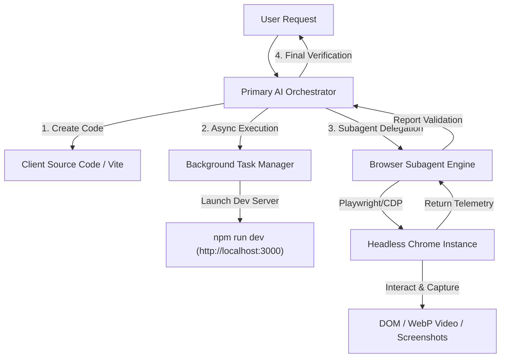

# Agentic Browser Automation & End-to-End Testing Guide

This guide details the complete **agentic orchestration architecture**, **background browser automation workflows**, tools, and verification procedures used to test the **AI SaaS Lab Client Dashboard**.

You can use this reference to replicate, extend, or customize automated browser subagents in your own local or self-deployed agentic AI setups (e.g., using Playwright, Puppeteer, Claude Computer Use API, AutoGPT, or custom AI agent frameworks).

---

## 1. Architecture Overview & Agentic Orchestration

The testing process relies on a **hierarchical multi-agent orchestration pattern**:



### Key Components

1. **Primary AI Orchestrator (Antigravity Planner)**:
   - Plans the feature implementation.
   - Generates code files (`App.tsx`, `MeteringSimulatorTab.tsx`, `JsonStudioTab.tsx`, etc.).
   - Runs non-blocking background build checks (`npm run build`).
2. **Background Task Manager (`run_command`)**:
   - Launches non-blocking asynchronous processes (e.g., `npm install`, `npm run dev`).
   - Monitored via task IDs without blocking the main event loop.
3. **Browser Subagent (`browser_subagent`)**:
   - An autonomous specialized sub-agent equipped with Chrome DevTools Protocol (CDP) and Playwright capabilities.
   - Takes a high-level goal prompt (e.g. *"Navigate to http://localhost:3000, click API Keys tab, drag metering sliders, verify JSON download"*).
   - Executes multi-step browser actions autonomously: DOM parsing, clicking, typing, dragging sliders, capturing WebP video recordings, and inspecting element states.

---

## 2. Step-by-Step Execution Workflow

### Step 1: Source Code Construction & Static Verification
Before initiating browser automation, the Primary Orchestrator verifies static type safety:
- Command executed: `cmd /c "npm run build"`
- Output checked: Zero TypeScript (`tsc`) compilation errors and clean Vite bundle output.

### Step 2: Asynchronous Server Launch
The local Vite web server is started as a non-blocking background task:
- Command: `cmd /c "npm run dev"` inside `client/`
- Target URL: `http://localhost:3000`
- Task state monitored using `manage_task` status checks.

### Step 3: Delegating Tasks to the Browser Subagent
The Primary Orchestrator invokes `browser_subagent` with structured arguments:
- `RecordingName`: `client_dashboard_flow` (generates an annotated WebP browser session recording).
- `TaskName`: `Testing Client Dashboard UI Flow`
- `Task`: Detailed task prompt specifying actions to perform.

#### Subagent Action Cycle:
```
[Start Subagent] 
   ├── Navigate(url: "http://localhost:3000")
   ├── Read DOM & Accessibility Tree
   ├── Click(selector: "API Keys tab")
   ├── Type(input: "Production API Key", field: "Key Name")
   ├── Click(button: "Generate Secret Key")
   ├── Click(selector: "Metering Sandbox tab")
   ├── DragSlider(slider: "Concurrent Users", value: 450)
   ├── Read Metrics(element: ".token-velocity", expected: "> 50,000 / sec")
   ├── Click(selector: "JSON Studio tab")
   ├── Click(button: "Export JSON")
   └── Return Detailed Validation Summary to Primary Agent
```

---

## 4. Replicating Browser Subagents Locally

To build a self-deployed browser subagent system in your own AI stack, combine an LLM (e.g., Gemini, Claude 3.5 Sonnet, or GPT-4o) with Playwright / Chrome DevTools Protocol:

### Replication Stack
- **Browser Controller**: [Playwright Node.js/Python](https://playwright.dev/) or [Puppeteer](https://pptr.dev/)
- **LLM Function Calling Schema**: Define functions for `open_url`, `click_element`, `type_text`, `drag_slider`, `capture_screenshot`.
- **Session Recorder**: Enable Playwright's `recordVideo` option to save `.mp4` or `.webm` recordings for auditing.

### Code Sample: Standalone Playwright Verification Script (Node.js)

```javascript
import { chromium } from 'playwright';

(async () => {
  const browser = await chromium.launch({ headless: true });
  const context = await browser.newContext({
    recordVideo: { dir: './artifacts/recordings/' },
    viewport: { width: 1536, height: 730 },
  });
  const page = await context.newPage();

  console.log('1. Navigating to Client Dashboard...');
  await page.goto('http://localhost:3000');
  await page.waitForSelector('h1');

  console.log('2. Verifying API Keys Tab...');
  await page.click('button:has-text("API Keys")');
  await page.click('button:has-text("Create Secret Key")');
  await page.fill('input[placeholder*="Production"]', 'Local Automation Key');
  await page.click('button:has-text("Generate Secret Key")');

  console.log('3. Testing Metering Sliders...');
  await page.click('button:has-text("Metering Sandbox")');
  const slider = await page.$('input[type="range"].gold-slider');
  if (slider) {
    await slider.fill('350');
  }

  console.log('4. Verifying JSON Studio Export...');
  await page.click('button:has-text("JSON Studio")');
  await page.click('button:has-text("Export JSON")');

  console.log('✅ All browser automation steps completed successfully!');
  await browser.close();
})();
```

---

## 5. Summary of Workflow Artifacts

- **Browser Configuration Schema**: `doc/agent-testing/browser_agent_config.json`
- **Testing Workflow Spec**: `doc/agent-testing/testing_workflow_spec.json`
- **Client Documentation**: `doc/client/walkthrough.md`

---

## 6. Hardware & Environment Requirements for Local Replication

### Is Local Replication Sufficient?
**Yes, 100%.** Headless browser automation and agent testing run locally with zero cloud dependencies. Running tests on your local machine provides instant feedback, zero network latency, and complete privacy.

### Recommended Laptop Hardware Specs

| Resource | Minimum Requirement | Recommended Specification |
| :--- | :--- | :--- |
| **Processor (CPU)** | Dual-core CPU (Intel i3 / AMD Ryzen 3) | Quad-core+ CPU (Intel i5/i7, AMD Ryzen 5/7, or Apple M1/M2/M3/M4) |
| **Memory (RAM)** | 8 GB RAM | 16 GB RAM (Smooth execution with IDE + Go backend + Vite + Headless Chrome) |
| **Storage Space** | 2 GB free disk space | 5 GB SSD storage |
| **Operating System** | Windows 10/11, macOS 12+, or Linux | Any OS (Windows PowerShell, macOS, Linux) |

### Software Setup Checklist (One-Time Setup)

1. **Install Node.js**:
   Download Node.js LTS (v20+ or v24+) from [nodejs.org](https://nodejs.org/).

2. **Install Playwright Browser Engine**:
   Run this single command in your terminal:
   ```bash
   npx playwright install chromium
   ```

3. **Run Automation Script**:
   ```bash
   node test_dashboard.js
   ```

---

## 7. Complete Browser Automation App Testing Without LLM (Step-by-Step)

### **Answer: YES! 100% YES.**

Complete end-to-end browser automation testing **does NOT require an LLM or AI model**. In fact, 99% of production enterprise web apps use deterministic browser automation frameworks (such as **Playwright**, **Cypress**, or **Puppeteer**) running standard JavaScript/TypeScript test scripts with **$0 API cost** and instant execution speed.

---

### Step-by-Step Setup Guide (No LLM Required)

#### Step 1: Install Playwright Test Framework
Inside the `client/` directory, install the Playwright test suite package:
```powershell
cd client
npm install -D @playwright/test
npx playwright install chromium
```

#### Step 2: Test Configuration File
We configured `client/playwright.config.ts` to automatically spin up the Vite dev server (`http://localhost:3000`), run Chromium in headless mode, capture screenshots on failure, and generate HTML test reports.

#### Step 3: Complete E2E Test Suite (`client/tests/dashboard.spec.ts`)
The test suite automatically performs the following assertions:
1. **Overview Verification**: Tests rendering of page titles and KPI cards (Active API Keys, Token Volume, Vector Storage, Spend).
2. **API Key Management Workflow**: Opens modal, enters key name, submits form, verifies table entry.
3. **Metering Sandbox Sliders**: Simulates user dragging range sliders and verifies real-time telemetry badge updates.
4. **JSON Studio**: Checks JSON payload rendering and tree formatting.
5. **API Playground**: Executes completion test requests and verifies latency inspection panels.

#### Step 4: Execute Full Automated Test Suite
To run all tests in headless mode (zero browser window popups):
```powershell
cd client
npx playwright test
```

To run tests in visual UI mode (watch the browser automate in real time):
```powershell
cd client
npx playwright test --ui
```

#### Step 5: View Interactive HTML Test Report
After test execution, generate and view the interactive visual report:
```powershell
npx playwright show-report
```

---

## 8. Summary of All Testing Configurations

| File Path | Purpose | LLM Required? |
| :--- | :--- | :--- |
| [playwright.config.ts](file:///d:/AK-FILES/Golang%20April/ai-saas-lab/ai-saas-lab/client/playwright.config.ts) | Playwright test runner configuration | **NO (0% LLM)** |
| [tests/dashboard.spec.ts](file:///d:/AK-FILES/Golang%20April/ai-saas-lab/ai-saas-lab/client/tests/dashboard.spec.ts) | Complete E2E browser automation test suite | **NO (0% LLM)** |
| [browser_agent_config.json](file:///d:/AK-FILES/Golang%20April/ai-saas-lab/ai-saas-lab/doc/agent-testing/browser_agent_config.json) | Schema config for AI browser subagents | YES (Optional for LLM agents) |
| [testing_workflow_spec.json](file:///d:/AK-FILES/Golang%20April/ai-saas-lab/ai-saas-lab/doc/agent-testing/testing_workflow_spec.json) | Machine-readable workflow specification graph | Meta specification |

