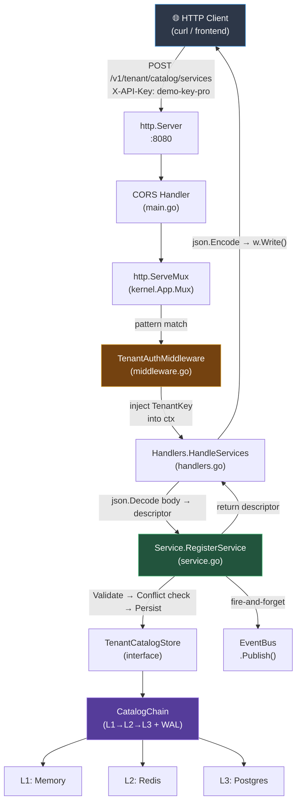

# Tenant Catalog Call Flow

End-to-end request lifecycle from user HTTP call to storage and back.

---

## Architecture Diagram



---

## Step-by-Step Call Flow

### 1. Bootstrap — [`main.go`](file:///d:/AK-FILES/Golang%20April/ai-saas-lab/ai-saas-lab/cmd/lab/main.go)

All wiring happens at startup, before any request arrives:

```
cfg := kernel.LoadConfig("config.env")      // L23 — load config
app := kernel.NewApp(cfg)                    // L24 — creates App with Mux, EventBus, CatalogChain
tenantMod := tenant.New(authMod.Service())   // L34 — pass auth dependency in
app.RegisterModule(tenantMod)                // L40 — enqueue for Init
app.InitAll()                                // L60 — calls tenantMod.Init(app) → routes wired
srv := &http.Server{Handler: corsHandler(app.Mux)}  // L84 — start listening
```

### 2. Module Init — [`module.go`](file:///d:/AK-FILES/Golang%20April/ai-saas-lab/ai-saas-lab/internal/modules/tenant/module.go)

[`Module.Init(app)`](file:///d:/AK-FILES/Golang%20April/ai-saas-lab/ai-saas-lab/internal/modules/tenant/module.go#L31-L63) wires everything:

```go
m.service  = NewService(app.TenantCatalog, app.Events)   // L36 — service gets catalog + events
m.handlers = NewHandlers(m.service)                       // L38 — handlers get service

// Routes wrapped with auth middleware:
authMW := func(h ...) http.HandlerFunc {
    return TenantAuthMiddleware(app, m.authService, h)    // L42
}
app.Mux.HandleFunc("POST /v1/tenant/catalog/services", authMW(m.handlers.HandleServices))  // L46
app.Mux.HandleFunc("GET  /v1/tenant/catalog/services", authMW(m.handlers.HandleServices))  // L47
```

**Object graph after Init:**

| Object | Type | Created via | Held by |
|--------|------|-------------|---------|
| `app` | `*kernel.App` | `kernel.NewApp(cfg)` | main, module closures |
| `app.Mux` | `*http.ServeMux` | inside `NewApp` | `http.Server.Handler` |
| `app.TenantCatalog` | `*kernel.CatalogChain` | `buildCatalogChain(cfg)` | `Service.catalog` |
| `app.Events` | `*kernel.EventBus` | `NewEventBus()` | `Service.events` |
| `m.service` | `*tenant.Service` | `NewService(...)` | `Handlers.service` |
| `m.handlers` | `*tenant.Handlers` | `NewHandlers(...)` | route closures |

> [!IMPORTANT]
> Every struct is allocated as a pointer (`&Struct{}`). All method receivers are pointer receivers. The interfaces (`http.ResponseWriter`, `TenantCatalogStore`) always hold pointers to concrete types.

---

### 3. Request arrives — the runtime call chain

```
HTTP POST /v1/tenant/catalog/services
  │
  ▼
┌─────────────────────────────────────────────────────────┐
│ http.Server.serve()                                     │
│   creates *http.response (concrete ResponseWriter)      │
│   calls corsHandler.ServeHTTP(w, r)                     │
└─────────────────────┬───────────────────────────────────┘
                      │
                      ▼
┌─────────────────────────────────────────────────────────┐
│ CORS Handler (main.go:72)                               │
│   Sets Access-Control-* headers                         │
│   Calls app.Mux.ServeHTTP(w, r)                         │
└─────────────────────┬───────────────────────────────────┘
                      │
                      ▼
┌─────────────────────────────────────────────────────────┐
│ http.ServeMux.ServeHTTP (app.Mux)                       │
│   Pattern matches "POST /v1/tenant/catalog/services"    │
│   Calls the registered HandlerFunc (= authMW closure)   │
└─────────────────────┬───────────────────────────────────┘
                      │
                      ▼
┌─────────────────────────────────────────────────────────┐
│ TenantAuthMiddleware (middleware.go:22)                  │
│   1. Extract API key from X-API-Key or Bearer header    │
│   2. app.CheckPolicies(ctx, apiKey, "valid-api-key")    │
│   3. authService.AuthenticateAndGetRecord(apiKey)       │
│   4. kernel.NewTenantKey(rec.Key) → tenantKey           │
│   5. ctx = context.WithValue(ctx, tenantKeyCtxKey{},    │
│          tenantKey)                                     │
│   6. next(w, r.WithContext(ctx))  ──────────────────────┤
└─────────────────────────────────────────────────────────┘
                      │
                      ▼
┌─────────────────────────────────────────────────────────┐
│ Handlers.HandleServices (handlers.go:67)                │
│   1. TenantKeyFromContext(r.Context()) → tenantKey      │
│   2. echoRequestID(w, r) — propagate X-Request-ID       │
│   3. Switch on r.Method:                                │
│      POST → json.Decode body → service.RegisterService  │
│      GET  → service.ListServices                        │
│   4. json.NewEncoder(w).Encode(result)                  │
│      ↑ This calls w.Write(jsonBytes) on the             │
│        *http.response behind the interface              │
└─────────────────────┬───────────────────────────────────┘
                      │ (POST path shown)
                      ▼
┌─────────────────────────────────────────────────────────┐
│ Service.RegisterService (service.go:30)                 │
│   1. Default name if empty                              │
│   2. descriptor.Validate() — charset, length, required  │
│   3. catalog.GetService() — conflict/duplicate check    │
│   4. catalog.RegisterService() — persist via chain      │
│   5. events.Publish(TopicServiceRegistered, ...) — async│
│   6. catalog.GetService() — re-fetch persisted copy     │
│   7. Return descriptor to handler                       │
└─────────────────────┬───────────────────────────────────┘
                      │
                      ▼
┌─────────────────────────────────────────────────────────┐
│ CatalogChain (kernel) — implements TenantCatalogStore   │
│   L1 Memory  → fast in-process cache                    │
│   L2 Redis   → shared cache across instances            │
│   L3 Postgres → durable persistence                     │
│   WAL        → write-ahead log for failure recovery     │
│                                                         │
│   Write: L1 → L2 → L3 (fan-out, WAL on failure)        │
│   Read:  L1 first, fall through to L2 → L3             │
└─────────────────────────────────────────────────────────┘
```

---

### 4. Response path (how bytes reach the client)

```
Service returns (descriptor, nil)
    ↓
Handler: w.WriteHeader(http.StatusCreated)     // sets status code
Handler: json.NewEncoder(w).Encode(descriptor)
    ↓
    json.Encoder.Encode() marshals to []byte
    calls enc.w.Write(jsonBytes)
    ↓
    w is http.ResponseWriter interface
    concrete type is *http.response (pointer receiver)
    ↓
    (*http.response).Write(jsonBytes)
    → bufio.Writer → net.Conn → TCP → client
```

---

## Key Design Patterns

| Pattern | Where | Why |
|---------|-------|-----|
| **Dependency Injection** | `tenant.New(authService)` → `NewService(catalog, events)` → `NewHandlers(service)` | Each layer receives only what it needs; testable |
| **Middleware Chain** | CORS → Mux → AuthMW → Handler | Cross-cutting concerns isolated; handler stays clean |
| **Context Propagation** | `context.WithValue(ctx, tenantKeyCtxKey{}, tk)` | Tenant identity travels through the call stack via `ctx` |
| **Interface Abstraction** | `Service` holds `TenantCatalogStore` (interface) | Service doesn't know if it's Memory, Redis, or Postgres behind it |
| **Multi-tier Storage** | `CatalogChain` L1→L2→L3 + WAL | Speed (memory) + durability (postgres) + resilience (WAL) |
| **Event-Driven Side Effects** | `events.Publish(TopicServiceRegistered, ...)` | Decouples registration from downstream reactions (billing, notifications) |
| **Module System** | `Module` interface with `Init/Start/Stop` | Each feature is self-contained; kernel orchestrates lifecycle |
