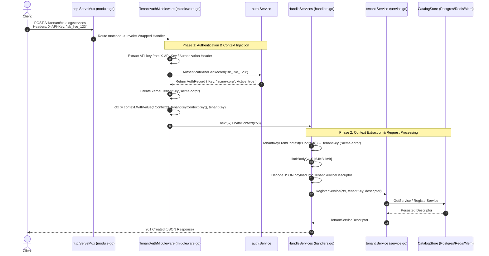

# End-to-End HTTP Request & Context Propagation Flow

This document details the complete end-to-end lifecycle of an HTTP request in the **AI SaaS Lab Tenant Module**, focusing on **`context.Context` propagation**, **authentication middleware**, and **handler execution**.

---

## 1. High-Level Architectural Flow



---

## 2. Route Registration & Middleware Wrapping

In [`module.go`](file:///d:/AK-FILES/Golang%20April/ai-saas-lab/ai-saas-lab/internal/modules/tenant/module.go), HTTP routes are registered on the standard Go `http.ServeMux`. Each route is wrapped using `TenantAuthMiddleware`:

```go
// internal/modules/tenant/module.go
wrap := func(h http.HandlerFunc) http.HandlerFunc {
    return TenantAuthMiddleware(app, m.authService, h)
}

// Routes registered with HTTP method matching (Go 1.22+)
mux.HandleFunc("POST /v1/tenant/catalog/services", wrap(handlers.HandleServices))
mux.HandleFunc("GET  /v1/tenant/catalog/services", wrap(handlers.HandleServices))
```

---

## 3. Detailed Component Breakdown

### Step 1: Authentication & Context Injection ([`middleware.go`](file:///d:/AK-FILES/Golang%20April/ai-saas-lab/ai-saas-lab/internal/modules/tenant/middleware.go))

1. **Extract API Key**: The middleware checks `X-API-Key` or `Authorization: Bearer <key>`.
2. **Authenticate Key**: Calls `authService.AuthenticateAndGetRecord(apiKey)`.
3. **Construct `TenantKey`**: Converts the validated account key into a domain-typed `kernel.TenantKey`.
4. **Inject into Context**:
   ```go
   // Stores the TenantKey into a NEW context derived from r.Context()
   ctx := context.WithValue(r.Context(), tenantKeyContextKey{}, tenantKey)
   
   // Forwards execution to the next handler with the enriched context
   next(w, r.WithContext(ctx))
   ```

> [!NOTE]
> **Context Isolation Guarantee**:
> `r.Context()` is bound strictly to the single incoming `*http.Request` goroutine. `context.WithValue` returns a child context without modifying global state, ensuring multi-tenant isolation and zero race conditions.

---

### Step 2: Context Extraction & Handling ([`handlers.go`](file:///d:/AK-FILES/Golang%20April/ai-saas-lab/ai-saas-lab/internal/modules/tenant/handlers.go))

When `HandleServices` executes:

```go
func (h *Handlers) HandleServices(w http.ResponseWriter, r *http.Request) {
    // 1. Extract the tenant key injected by TenantAuthMiddleware
    tenantKey, ok := TenantKeyFromContext(r.Context())
    if !ok {
        w.WriteHeader(http.StatusUnauthorized)
        _ = json.NewEncoder(w).Encode(map[string]any{"error": "tenant context missing"})
        return
    }
    
    echoRequestID(w, r)

    switch r.Method {
    case http.MethodPost:
        limitBody(w, r) // Apply 64KB body limit guard
        
        var descriptor kernel.TenantServiceDescriptor
        if err := json.NewDecoder(r.Body).Decode(&descriptor); err != nil {
            writeError(w, err)
            return
        }

        // 2. Delegate business logic to Service layer with Context & TenantKey
        res, err := h.service.RegisterService(r.Context(), tenantKey, descriptor)
        if err != nil {
            writeError(w, err)
            return
        }

        writeJSON(w, http.StatusCreated, res)
    ...
```

---

### Step 3: Domain Service Execution ([`service.go`](file:///d:/AK-FILES/Golang%20April/ai-saas-lab/ai-saas-lab/internal/modules/tenant/service.go))

The service layer receives both `ctx context.Context` (for timeout/cancellation/tracing propagation) and `tenantKey kernel.TenantKey` (for tenant scoping):

```go
func (s *Service) RegisterService(ctx context.Context, tenant kernel.TenantKey, descriptor kernel.TenantPlanDescriptor) (...) {
    // 1. Validate domain constraints & referential integrity
    // 2. Persist to tenant catalog store using tenant as composite primary key
    // 3. Publish asynchronous domain events via kernel EventBus
}
```

---

## 4. Summary Matrix: Context Data Flow

| Stage | Location | Context Action | Key Type / Value |
|---|---|---|---|
| **Incoming HTTP** | Net/HTTP Server | Creates base `r.Context()` | Standard Request Context |
| **Middleware** | [`middleware.go:67`](file:///d:/AK-FILES/Golang%20April/ai-saas-lab/ai-saas-lab/internal/modules/tenant/middleware.go#L67) | `context.WithValue()` | Key: `tenantKeyContextKey{}`<br/>Value: `kernel.TenantKey` |
| **Handler** | [`handlers.go:69`](file:///d:/AK-FILES/Golang%20April/ai-saas-lab/ai-saas-lab/internal/modules/tenant/handlers.go#L69) | `TenantKeyFromContext()` | Reads `kernel.TenantKey` safely via type assertion |
| **Service & DB** | [`service.go:198`](file:///d:/AK-FILES/Golang%20April/ai-saas-lab/ai-saas-lab/internal/modules/tenant/service.go#L198) | Pass `ctx` & `tenantKey` | `ctx` propagated for IO/tracing, `tenantKey` for data partitioning |
