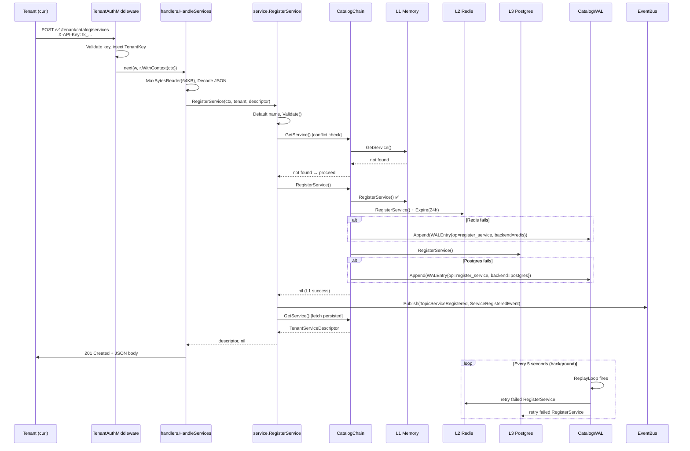

# RegisterService — Full Lifecycle Flow

This document traces the complete path of a tenant registration request from the HTTP wire through every layer of the system.

---

## Architecture Overview

```
Tenant (curl/SDK)
  │  POST /v1/tenant/catalog/services
  │  Headers: X-API-Key, X-Request-ID
  ▼
TenantAuthMiddleware           ← validates API key, injects TenantKey into context
  ▼
handlers.HandleServices()      ← decodes body, enforces 64KB limit, echoes X-Request-ID
  ▼
service.RegisterService()      ← validates, conflict-checks, persists, publishes event
  ▼
CatalogChain.RegisterService() ← write-through: L1 → L2 → L3, WAL on partial failure
  ├── L1: MemoryTenantCatalogStore   (in-process, always fast)
  ├── L2: RedisTenantCatalogStore    (distributed cache, TTL=24h)
  └── L3: PostgresTenantCatalogStore (source of truth, audit trail)
  ▼ (on L2/L3 failure)
CatalogWAL.Append()            ← sealed segment under ./data/wal/catalog/
  └── ReplayLoop (goroutine)   ← retries failed writes every 5 seconds
  ▼
EventBus.Publish(TopicServiceRegistered, ServiceRegisteredEvent)
  └── Subscribers receive typed payload (any registered handler)
  ▼
HTTP 201 Created
  Body: { "service_id": "...", "name": "...", "created_at": "..." }
```

---

## Detailed Step-by-Step

### 1. Network → `TenantAuthMiddleware`

**File:** [`internal/modules/tenant/middleware.go`](../internal/modules/tenant/middleware.go)

```
Request → extract X-API-Key (or Authorization: Bearer)
        → CheckPolicies(apiKey, "valid-api-key")   → 401 if invalid
        → authService.AuthenticateAndGetRecord()    → 401 if inactive
        → kernel.NewTenantKey(rec.Key)              → sets context
        → next handler
```

- Sets `Content-Type: application/json` for **all** responses via `w.Header().Set`.
- `TenantKey` is injected into `context.Context` via `tenantKeyContextKey{}`.

### 2. `handlers.HandleServices()` — POST branch

**File:** [`internal/modules/tenant/handlers.go`](../internal/modules/tenant/handlers.go)

```
r.Body = http.MaxBytesReader(w, r.Body, 64*1024)  ← 413 on overflow
json.NewDecoder(r.Body).Decode(&descriptor)        ← 400 on malformed JSON
service.RegisterService(ctx, tenantKey, descriptor)
```

**Error mapping in `writeError()`:**

| CatalogError Kind   | HTTP Status                        |
|---------------------|------------------------------------|
| `kindConflict`      | **409 Conflict**                   |
| `kindValidation`    | **422 Unprocessable Entity**       |
| `kindNotFound`      | **404 Not Found**                  |
| `kindBackend`       | **503 Service Unavailable**        |
| `MaxBytesError`     | **413 Request Entity Too Large**   |
| anything else       | **400 Bad Request**                |

### 3. `service.RegisterService()` — Orchestration

**File:** [`internal/modules/tenant/service.go`](../internal/modules/tenant/service.go)

| Step | Action | Failure |
|------|--------|---------|
| 1 | Default `name` to `service_id` if omitted | — |
| 2 | `descriptor.Validate()` | → `*CatalogError{kindValidation}` → 422 |
| 3 | `catalog.GetService()` — check for duplicate | → `*CatalogError{kindConflict}` → 409 |
| 4 | `catalog.RegisterService()` — persist | → `*CatalogError{kindBackend}` → 503 |
| 5 | `events.Publish(TopicServiceRegistered, ...)` | fire-and-forget |
| 6 | `catalog.GetService()` — fetch persisted result | → 400 |

### 4. `CatalogChain.RegisterService()` — Storage Orchestration

**File:** [`internal/kernel/catalog_chain.go`](../internal/kernel/catalog_chain.go)

```
for each backend in [L1-memory, L2-redis, L3-postgres]:
    backend.RegisterService(ctx, tenant, svc)
    if error:
        if backend != "memory":
            wal.Append(CatalogWALEntry{op="register_service", ...})
        record firstErr

if L1 (memory) succeeded → return nil  ← immediate consistency guaranteed
else → NewBackendError("all", firstErr) → 503
```

**Read-through (GetService):**
```
for each backend in [L1, L2, L3]:
    svc, found = backend.GetService()
    if found:
        backfill all faster layers (i < foundAt)
        return svc
```

### 5. `CatalogWAL` — Failure Recovery

**File:** [`internal/kernel/catalog_wal.go`](../internal/kernel/catalog_wal.go)

- Segments stored in `./data/wal/catalog/`
- Active segment: `catalog_wal_<timestamp>_<n>.active`
- Sealed after `10 MB` or `10 min`, renamed to `.sealed`
- `ReplayLoop` goroutine retries every **5 seconds** (CATALOG_WAL_RETRY_MS configurable)
- `replayWALEntry()` dispatches back to the specific failed backend (by name)
- Successfully replayed segments are **deleted**

### 6. `EventBus.Publish()` — Typed Event

**File:** [`internal/kernel/types.go`](../internal/kernel/types.go)

```go
// Topic constant
kernel.TopicServiceRegistered = "tenant.service.registered"

// Typed payload
kernel.ServiceRegisteredEvent{
    TenantKey:    "tk_...",
    ServiceID:    "ai-writer",
    Name:         "AI Writer Engine",
    RegisteredAt: time.Now().UTC(),
}
```

`Publish` fans out synchronously to all registered subscriber callbacks for the topic. No subscribers for catalog topics yet — safe to extend.

---

## Validation Rules Summary

### `service_id` (ServiceID)
| Rule | Limit |
|------|-------|
| Required | yes |
| Charset | `[a-z0-9_-]` only |
| Pattern | must start AND end with `[a-z0-9]` |
| Max length | 64 characters |

### `name`
| Rule | Limit |
|------|-------|
| Auto-defaults | to `service_id` value if omitted |
| Whitespace-only | rejected |
| Max length | 128 characters |

### `description`
| Rule | Limit |
|------|-------|
| Optional | yes |
| Max length | 512 characters |

---

## Data Flow Diagram



---

## HTTP Routes Reference

| Method | Route | Handler | Success |
|--------|-------|---------|---------|
| `POST` | `/v1/tenant/catalog/services` | `HandleServices` | 201 |
| `GET`  | `/v1/tenant/catalog/services` | `HandleServices` | 200 |
| `GET`  | `/v1/tenant/catalog/services/{id}` | `HandleGetService` | 200 |
| `POST` | `/v1/tenant/catalog/metrics` | `HandleMetrics` | 201 |
| `GET`  | `/v1/tenant/catalog/metrics` | `HandleMetrics` | 200 |
| `GET`  | `/v1/tenant/catalog/metrics/{id}` | `HandleGetMetric` | 200 |
| `POST` | `/v1/tenant/catalog/plans` | `HandlePlans` | 201 |
| `GET`  | `/v1/tenant/catalog/plans` | `HandlePlans` | 200 |
| `GET`  | `/v1/tenant/catalog/plans/{id}` | `HandleGetPlan` | 200 |
| `GET`  | `/v1/tenant/catalog/overview` | `HandleOverview` | 200 |

All routes require `X-API-Key` or `Authorization: Bearer <key>`.
